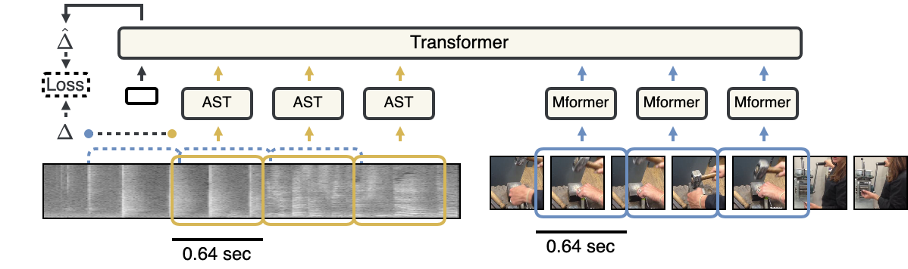
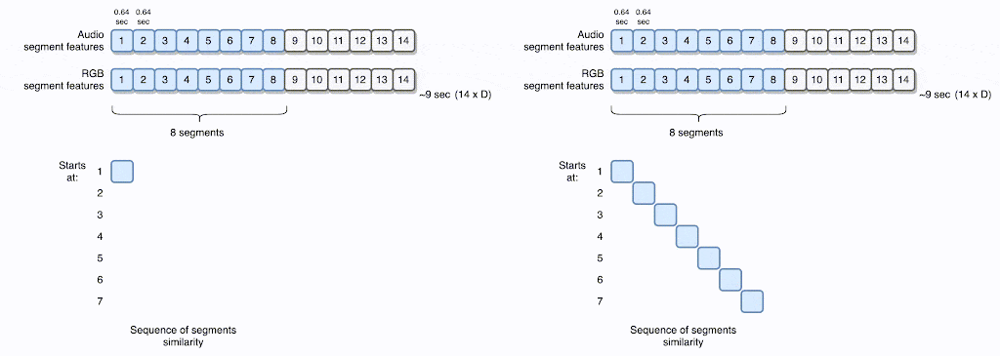
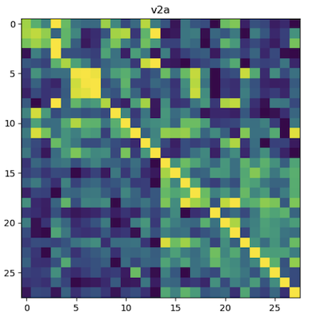

# Synchformer: Efficient Synchronization from Sparse Cues

```bibtex
@InProceedings{synchformer2024iashin,
  title={Synchformer: Efficient Synchronization from Sparse Cues},
  author={Iashin, V., Xie, W., Rahtu, E. and Zisserman, A.},
  booktitle={ICASSP 2024-2024 IEEE International Conference on Acoustics, Speech and Signal Processing (ICASSP)},
  year={2024},
  organization={IEEE}
}
```

• [[Project Page](https://www.robots.ox.ac.uk/~vgg/research/synchformer/)]
• [[arXiv](https://arxiv.org/abs/2401.16423)] •
<!-- • [[BMVC Proceedings](https://bmvc2022.mpi-inf.mpg.de/395/)] -->
<!-- • [[Presentation (spotlight)](https://www.youtube.com/watch?v=DKNNQ54zkIw)] • -->

[](https://colab.research.google.com/github/v-iashin/Synchformer/blob/main/example.ipynb)




Given audio and visual streams, a synchronization model predicts the temporal offset between them.
Instead of extracting features from the entire video, we extract features from shorter temporal segments (0.64 sec) of the video.
The segment-level audio and visual inputs are fed into their respective feature extractors independently to obtain temporal features.
Finally, the synchronization module inputs the concatenated sequence of audio and visual features to predict the temporal offset.
We call our model Synchformer.

- [Synchformer: Efficient Synchronization from Sparse Cues](#synchformer-efficient-synchronization-from-sparse-cues)
  - [Install](#install)
  - [Examples](#examples)
  - [Pre-trained Models](#pre-trained-models)
    - [Audio-visual synchronization models](#audio-visual-synchronization-models)
    - [Segment-level feature extractors](#segment-level-feature-extractors)
    - [Synchronizability prediction](#synchronizability-prediction)
  - [Training](#training)
    - [Prepare Data](#prepare-data)
    - [Segment-level audio-visual contrastive pre-training of feature extractors](#segment-level-audio-visual-contrastive-pre-training-of-feature-extractors)
    - [Audio-visual synchronization module training](#audio-visual-synchronization-module-training)
    - [Fine-tune for synchronizability](#fine-tune-for-synchronizability)
  - [Evalution](#evalution)
    - [Synchronization](#synchronization)
    - [Synchronizability](#synchronizability)
  - [Acknowledgements](#acknowledgements)


## Install
During experimentation, we used Linux machines with a (mini)`conda` virtual environment.
We tested our model on both Nvidia (CUDA 11.8) and AMD (ROCm 5.4.2) GPUs,
and the inference code should work for both.

To install CUDA environment, run the following,
```bash
conda env create -f conda_env.yml
# check the installation, if `av` is > 9.0.0, you may need to downgrade to reproduce the results
conda activate synchformer
conda list av
# # Name                    Version                   Build  Channel
# av                        9.0.0                    pypi_0    pypi
```

If you have a capable AMD GPU, you need to replace the `conda_env.yml` with `conda_env_for_AMD_CUDA.yml`.


## Examples

Start by preparing the environment (see [above](#environment-preparation)).

This script applies the `--offset_sec` offset to the provided video `--vid_path` and
runs the prediction with the provided `--exp_name` model (AudioSet-pretrained).
In this example, the audio track will be 1.6 seconds early.
```bash
python example.py \
  --exp_name "24-01-04T16-39-21" \
  --vid_path "./data/vggsound/h264_video_25fps_256side_16000hz_aac/3qesirWAGt4_20000_30000.mp4" \
  --offset_sec 1.6

# Prediction Results:
# p=0.8076 (11.5469), "1.60" (18)
# ...
```
NOTE: if you are getting `p=0.9482 (12.1250), "1.60" (18)`, you need to downgrade `av` to `8.1.0` (if you can't install it, try `9.0.0`).
See [Issue #11](https://github.com/v-iashin/Synchformer/issues/11) for context.

Making the audio track lag is also straightforward and can be achieved with a negative offset (note that we need to start the visual track later to accommodate the earlier start of the audio track):
```bash
python example.py \
  --exp_name "24-01-04T16-39-21" \
  --vid_path "./data/vggsound/h264_video_25fps_256side_16000hz_aac/ZYc410CE4Rg_0_10000.mp4" \
  --offset_sec -2.0 \
  --v_start_i_sec 4.0

# Prediction Results:
# p=0.8291 (12.7734), "-2.00" (0)
# ...
```
NOTE: if you are getting `p=0.7129 (11.8047), "-2.00" (0)`, you need to downgrade `av` to `8.1.0` (if you can't install it, try `9.0.0`).
See [Issue #11](https://github.com/v-iashin/Synchformer/issues/11) for context.

## Pre-trained Models

### Audio-visual synchronization models

Below are the pre-trained synchronization models.
If you need the feature extractors' weights, see the [segment-level feature extractors](#segment-level-feature-extractors) section.

| CKPT ID | S1 train dataset | S2 train dataset | Test dataset | Acc@1 / Acc@1 ±1 cls | |
| --- | --- | ---  | --- | --- | --- |
| `23-12-23T18-33-57` | LRS3 ('Full Scene') | LRS3 ('Full Scene') | LRS3 ('Full Scene') | 86.6 / 99.6 | [config](https://a3s.fi/swift/v1/AUTH_a235c0f452d648828f745589cde1219a/sync/sync_models/23-12-23T18-33-57/cfg-23-12-23T18-33-57.yaml) / [ckpt](https://a3s.fi/swift/v1/AUTH_a235c0f452d648828f745589cde1219a/sync/sync_models/23-12-23T18-33-57/23-12-23T18-33-57.pt) (md5: `4415276...`) |
| `24-01-02T10-00-53` | VGGSound            |            VGGSound |     VGGSound-Sparse | 43.8 / 60.2 | [config](https://a3s.fi/swift/v1/AUTH_a235c0f452d648828f745589cde1219a/sync/sync_models/24-01-02T10-00-53/cfg-24-01-02T10-00-53.yaml) / [ckpt](https://a3s.fi/swift/v1/AUTH_a235c0f452d648828f745589cde1219a/sync/sync_models/24-01-02T10-00-53/24-01-02T10-00-53.pt) (md5: `19592ed...`) |
| `24-01-04T16-39-21` | AudioSet            |            AudioSet |     VGGSound-Sparse | 47.2 / 67.4 | [config](https://a3s.fi/swift/v1/AUTH_a235c0f452d648828f745589cde1219a/sync/sync_models/24-01-04T16-39-21/cfg-24-01-04T16-39-21.yaml) / [ckpt](https://a3s.fi/swift/v1/AUTH_a235c0f452d648828f745589cde1219a/sync/sync_models/24-01-04T16-39-21/24-01-04T16-39-21.pt) (md5: `54037d2...`) |

The metric is Accuracy@1 / Accuracy@1 ±1 class.
Note that the numbers on the metric vary slightly and are better than in the paper.
The numbers in the paper are the average performance across multiple _training_
runs from scratch (including these) --
for details see the note on the reproducibility in the supplementary material.

### Segment-level feature extractors

If you want to play with pre-trained feature extractors separately,
you may download them using the following links,
| CKPT ID | Train dataset | |
| --- | --- | --- |
| `23-12-22T16-04-18` | LRS3 ('Full Scene') | [config](https://a3s.fi/swift/v1/AUTH_a235c0f452d648828f745589cde1219a/sync/sync_models/23-12-22T16-04-18/cfg-23-12-22T16-04-18.yaml) / [ckpt](https://a3s.fi/swift/v1/AUTH_a235c0f452d648828f745589cde1219a/sync/sync_models/23-12-22T16-04-18/checkpoints/epoch_best.pt) (md5: `20b6e55...`) |
| `23-12-22T16-10-50` | VGGSound            | [config](https://a3s.fi/swift/v1/AUTH_a235c0f452d648828f745589cde1219a/sync/sync_models/23-12-22T16-10-50/cfg-23-12-22T16-10-50.yaml) / [ckpt](https://a3s.fi/swift/v1/AUTH_a235c0f452d648828f745589cde1219a/sync/sync_models/23-12-22T16-10-50/checkpoints/epoch_best.pt) (md5: `a9979df...`) |
| `23-12-22T16-13-38` | Audioset            | [config](https://a3s.fi/swift/v1/AUTH_a235c0f452d648828f745589cde1219a/sync/sync_models/23-12-22T16-13-38/cfg-23-12-22T16-13-38.yaml) / [ckpt](https://a3s.fi/swift/v1/AUTH_a235c0f452d648828f745589cde1219a/sync/sync_models/23-12-22T16-13-38/checkpoints/epoch_best.pt) (md5: `4a566f2...`) |


The checkpoint files contain weights from both the audio and visual feature extractors and will match the
state of `AVCLIP` in `./model/modules/feat_extractors/train_clip_src/open_clip/model.py`.
To get the weights of the audio or visual feature extractor separately,
you may need to filter the keys.
To save your time, see
the code for feature extractors' `__init__` methods after the line
`if was_pt_on_avclip: ...` in particular.


### Synchronizability prediction

The synchronizability model is fine-tuned from the synchronization model.
The checkpoint is available at the following link,

| CKPT ID | Train dataset | Test dataset | Acc@1 | AUCROC | |
| --- | --- | --- | --- | --- | --- |
| `24-01-22T20-34-52` | AudioSet | VGGSound-Sparse | 73.5 | 0.83 | [config](https://a3s.fi/swift/v1/AUTH_a235c0f452d648828f745589cde1219a/sync/sync_models/24-01-22T20-34-52/cfg-24-01-22T20-34-52.yaml) / [ckpt](https://a3s.fi/swift/v1/AUTH_a235c0f452d648828f745589cde1219a/sync/sync_models/24-01-22T20-34-52/24-01-22T20-34-52.pt) (md5: `b1cb346...`) |

\* -- we use the `VGGSoundSparsePickedCleanTest` dataset for multi-iteration (also `iter_times=25`) evaluation.

## Training

The synchronization models are trained in two stages:
1. Segment-level audio-visual contrastive pre-training of feature extractors
2. Audio-visual synchronization module training

### Prepare Data

We follow the data preparation procedure of
[SparseSync](https://github.com/v-iashin/SparseSync).
For LRS3 and VGGSound datasets, please refer to that the details
[how to prepare the data in SparseSync repo](https://github.com/v-iashin/SparseSync?tab=readme-ov-file#prepare-data).
AudioSet is processed similarly to VGGSound.

### Segment-level audio-visual contrastive pre-training of feature extractors

```bash
# conda activate synchformer
python ./main.py \
     config=./configs/segment_avclip.yaml \
     logging.logdir=/path/to/logging_dir/ \
     data.vids_path=/path/to/lrs3/h264_uncropped_25fps_256side_16000hz_aac/ \
     data.dataset.target=dataset.lrs.LRS3 \
     training.base_batch_size=2

# - add `logging.use_wandb=True` for logging to wandb
# - see ./scripts/sbatch_*.sh for the batch job submission scripts
# - if training in DDP hangs after an epoch, downgrade `av` to `8.1.0` (see Issue #11 for context).
```
It will download pre-trained models
([AST](https://huggingface.co/docs/transformers/model_doc/audio-spectrogram-transformer)
and [Motionformer](https://github.com/facebookresearch/Motionformer))
on the first run.

To train on AudioSet or VGGSound, replace the `vids_path` and dataset target
`data.dataset.target=dataset.audioset.AudioSet`
or `data.dataset.target=dataset.vggsound.VGGSound`.
Note, the LRS3 model was trained with `learning_rate=0.00005` and without audio-visual augmentation, ie.
see config of the `23-12-23T18-33-57` experiment.

This stage requires a GPU with high memory capacity, so if you running into issues with OOM, you may try dropping batch size per GPU to 1 (from 2),
lowering `n_segments` (mind the `run_shifted_win_val_winsize`), or reusing the pre-trained weights.
We trained this stage on 4 nodes with 4 (8) AMD Instinct MI250 GPUs
for 10 hours (30 epochs) on LRS3 (but decent results after 1 hour), 24 hours on VGGSound (20 epochs),
12 days (28 epochs) on AudioSet (loss didn't saturate).

To resume training, run the following,
```bash
CKPT_ID="xx-xx-xxTxx-xx-xx"  # replace this with the exp folder name

python main.py \
    config="/path/to/logging_dir/$CKPT_ID/cfg-$CKPT_ID.yaml" \
    training.resume="latest"
```
(you may need to specify paths if you are resuming our checkpoints).

To track the performance during training, we make zero-shot evaluation on offset detection
with 0.64 (segment length) step size.
In particular, we take `run_shifted_win_val_winsize` (8) consecutive segments from an audio/visual track (that consists of `n_segments` (14)) and compute the dot product between the
corresponding windows (the first window of the audio track and the first window of the visual track, etc.),
and the dot product between the first window of the audio track and the other windows of the visual track, and vice versa.
See the figure below for an example.
If the dot product between the corresponding windows is higher than the dot product between the other windows (within a row), we consider this as a correct prediction.
Then, we average the accuracy over all the rows.



In addition, we keep an eye on the individual segment similarity matrix (computed in `log_sim_matrices()`).
An example from LRS3:



The brighter the value in a matrix, the higher the similarity between the corresponding segments.
For the `v2a`, each row corresponds to a visual segment, and each column corresponds to an audio segment.
This results in a square matrix with the side size: `n_segments * batch_size`.

### Audio-visual synchronization module training

During this stage, the feature extractors are frozen, and only the synchronization module is trained.
```bash
S1_CKPT_ID="xx-xx-xxTxx-xx-xx"  # replace this with an exp folder name
EPOCH="best"

python main.py \
    config=./configs/sync.yaml \
    logging.logdir=/path/to/logging_dir/ \
    data.vids_path=/path/to/lrs3/h264_uncropped_25fps_256side_16000hz_aac/ \
    data.dataset.target=dataset.lrs.LRS3 \
    model.params.vfeat_extractor.params.ckpt_path="/path/to/logging_dir/${S1_CKPT_ID}/checkpoints/epoch_${EPOCH}.pt" \
    model.params.afeat_extractor.params.ckpt_path="/path/to/logging_dir/${S1_CKPT_ID}/checkpoints/epoch_${EPOCH}.pt" \
    training.base_batch_size=16

# - Also see ./scripts/sbatch_*.sh for the batch job submission scripts
# - If training in DDP hangs after an epoch, downgrade `av` to `8.1.0` (see Issue #11 for context).
```
To use our pre-trained feature extractors, replace the `ckpt_path` arguments with the paths to the downloaded checkpoint.

To train on AudioSet or VGGSound, replace the `vids_path` and dataset target
`data.dataset.target=dataset.audioset.AudioSet`
or `data.dataset.target=dataset.vggsound.VGGSound`.

We trained this stage on the same infrastructure as the first stage, yet the training is not bounded by
the GPU memory because the feature extractors are frozen.
One could increase the throughput by increasing the batch size per GPU if RAM, CPU count, and disk I/O allow.

The training took 2 days (283 epochs) on LRS3 (decent results after 12 hours), 8 days on VGGSound (326 epochs),
and 10 days on AudioSet (61 epochs).

We noticed that the _validation set_ loss doesn't correlate with the performance on the validation set and
fluctuates a lot, so we recommend relying on the validation set accuracy.

There is also a 'warmup' stage (~`4k x training_elements`), during which the performance of the model does not
start to improve.
This doesn't correlate with the learning rate schedule.
See [this plot](https://github.com/v-iashin/SparseSync/issues/2#issuecomment-1410959219) for details.

To resume training, run the following,
```bash
CKPT_ID="xx-xx-xxTxx-xx-xx"  # replace this with an exp folder name

python main.py \
    config="/path/to/logging_dir/$CKPT_ID/cfg-$CKPT_ID.yaml" \
    training.resume="True" training.finetune="False"
```
(you may need to specify paths if you are resuming our checkpoints).

### Fine-tune for synchronizability

We fine-tune the synchronization model for the task of synchronizability.
In particular, we fine-tune ('unfreeze') the stage II model and
replace the 21-class classification head with a 2-class classification head.

To fine-tune the synchronization model for the task of synchronizability, run the following,

```bash
S2_CKPT_ID="xx-xx-xxTxx-xx-xx"  # replace this with an exp folder name

python main.py \
    start_time="$NOW" \
    config="./configs/ft_synchability.yaml" \
    training.finetune="True" \
    ckpt_path="/path/to/logging_dir/$S2_CKPT_ID/$S2_CKPT_ID.pt" \
    data.dataset.target=dataset.audioset.AudioSet
    data.vids_path=/path/to/audioset/h264_video_25fps_256side_16000hz_aac/ \
    logging.logdir=/path/to/logging_dir/ \
    # logging.use_wandb=True

# - If training in DDP hangs after an epoch, downgrade `av` to `8.1.0` (see Issue #11 for context).
```

## Evalution

### Synchronization
To evaluation the performance of the synchronization model, run the following,
```bash
# experiment id from `./logs/sync_models/xx-xx-xxTxx-xx-xx`
S2_CKPT_ID="xx-xx-xxTxx-xx-xx"

torchrun --standalone --nnodes=1 --nproc-per-node=1 --master_addr=localhost --master_port=1234 \
main.py \
    config="/path/to/logging_dir/$S2_CKPT_ID/cfg-$S2_CKPT_ID.yaml" \
    ckpt_path="/path/to/logging_dir/$S2_CKPT_ID/$S2_CKPT_ID.pt" \
    logging.logdir="/path/to/logging_dir" \
    training.finetune="False" \
    training.run_test_only="True" \
    data.iter_times="5" \
    data.dataset.params.load_fixed_offsets_on="[]" \
    logging.log_code_state=False \
    model.params.afeat_extractor.params.ckpt_path=null \
    model.params.vfeat_extractor.params.ckpt_path=null \
    training.base_batch_size=8 \
    logging.log_frequency=4 \
    logging.use_wandb=False

# - if the numbers for accuracy_1 is significantly lower, downgrade `av` to `8.1.0` or `9.0.0` (see Issue #11 for context).
```
Note, the `a/vfeat_extractor` paths are set to `null`, because they are included in the synchronization model checkpoint,
and we don't need to load them twice.

If you want to test the `S2_CKPT_ID` on a different dataset, add the `data.dataset.target` argument
(e.g. for the manually cleaned VGGSound Sparse `data.dataset.target=dataset.vggsound.VGGSoundSparsePickedCleanTestFixedOffsets`).
By default, it will evaluate on the test set of the training dataset (different video IDs).

Following [previous work](https://github.com/v-iashin/SparseSync),
we run evaluation with `data.iter_times` > 1
and `data.dataset.params.load_fixed_offsets_on="[]"` on small datasets to allow for a more robust estimate of model performance.
For instance, for LRS3 we use `data.iter_times="2"`, for VGGSound-Sparse we use `data.iter_times="25"`.
Please replace the above accordingly.
Note that `dataset.vggsound.VGGSoundSparsePickedCleanTestFixedOffsets`
has fixed offsets, so we can't run multiple iterations.

### Synchronizability
To evaluate the synchronizability, run the following,

```bash
S3_CKPT_ID="xx-xx-xxTxx-xx-xx"

torchrun --standalone --nnodes=1 --nproc-per-node=1 --master_addr=localhost --master_port=1234 \
scripts/test_syncability.py \
    config_sync="/path/to/logging_dir/${S3_CKPT_ID}/cfg-${S3_CKPT_ID}.yaml" \
    ckpt_path_sync="/path/to/logging_dir/${S3_CKPT_ID}/${S3_CKPT_ID}_best.pt" \
    logging.logdir="/path/to/logging_dir" \
    training.finetune=False \
    training.run_test_only=True \
    data.dataset.target=dataset.vggsound.VGGSoundSparsePickedCleanTest \
    data.vids_path="path/to/vggsound/h264_video_25fps_256side_16000hz_aac/" \
    data.n_segments=14 \
    data.dataset.params.iter_times=25 \
    data.dataset.params.load_fixed_offsets_on="[]" \
    logging.log_code_state=False \
    model.params.afeat_extractor.params.ckpt_path=null \
    model.params.vfeat_extractor.params.ckpt_path=null \
    training.base_batch_size=8 \
    logging.log_frequency=4 \
    logging.use_wandb=False
```
Note, the `a/vfeat_extractor` paths are set to `null`, because they are included in the synchronization model checkpoint,
and we don't need to load them twice.

if you like to evaluate how well the synchronization model performs across
different synchronizability thresholds (Figure 4, right). Specify the `config_off` and `ckpt_path_off` arguments (with paths to the synchronization model).


## Acknowledgements

A few shoutouts to the open-source projects that we used in this work:
- [SparseSync](https://github.com/v-iashin/SparseSync)
- [Motionformer](https://github.com/facebookresearch/Motionformer)
- [AST in HuggingFace](https://huggingface.co/docs/transformers/model_doc/audio-spectrogram-transformer)
- [minGPT](https://github.com/karpathy/minGPT)
- [pre-trained S3D network in PyTorch](https://github.com/kylemin/S3D)
- and, of course, PyTorch, Numpy, and other open-source projects that we used in this work (see environments in `*.yml`).

This research was funded by the Academy of Finland projects 327910 and 324346, EPSRC Programme Grant VisualAI EP/T028572/1,
and a Royal Society Research Professorship.
We also acknowledge CSC (Finland) for awarding this project access to the LUMI supercomputer,
owned by the EuroHPC JU, hosted by CSC and the LUMI consortium through CSC.
